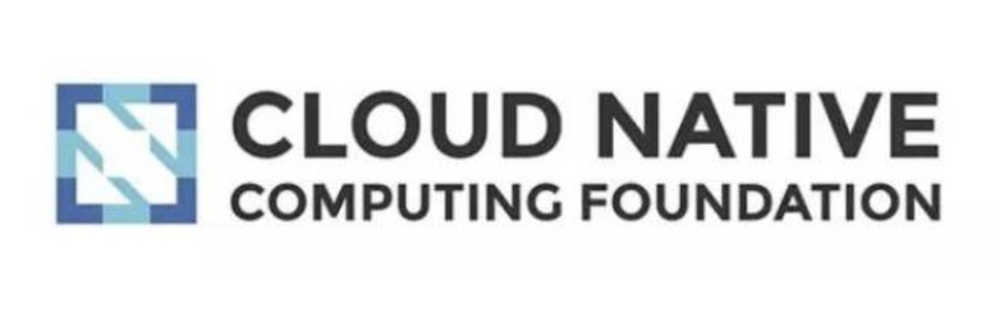

   

  
  
  

## 1.前言

鉴于市面上，云原生相关的技术太过于碎片化，不利于系统性学习和积累，本系列将用来复现一个云原生技术完善且系统的学习路径和难点，以及自己对其的一些理解。

专题的出发点：一方面积累自己的知识和经验，另一方面也希望通过这个专题，能帮助到相关技术人员。

## 2.学习规划

### 1.学习路线

在学习之前，我们需要先制定一个学习路线，循序渐进的学习，这样不至于一头雾水，无处下手。本专题的学习路线如下：

1. Docker篇

   积累`Docker`日常使用的心得，让你`1天`通关`dockerfile`和`docker-compose`。

2. Kubernetes篇

   真正的从0->1，渐进式的让你完美通关`kubernetes`。

3. Ceph篇

   待完善。

4. Prometheus篇

   待完善。

         
5. Istio篇

   真正的从0->1，感受Istio的魅力和机遇。

### 2.专题进度预览

这是个人梳理的Cloud Native专题，暂定目录如下，请按需进行阅读:

- Docker：已完成，共3章
- Kubernetes：已完成，共28章
- Ceph：更新至第1章：Ceph简介
- Istio：更新至第12章：xDS API及动态配置_2
- Prometheus：更新至第1章：快速部署

## 3.封神榜

您的赞赏，是对我专题持续更新最大的认可和鼓励。

 
点击收起/打开赞赏名单

  

## 4.赞赏名单:art:
| 昵称  |  赞赏时间  | 赞赏方式 | 赞赏金额 |   备注   |
| :---: | :--------: | :------: | :------: | :------: |
|    | |   |   |    -     |
|    | |   |   |    -     |

感谢以上朋友，十分感谢！！！ :pray: :pray: :pray:

## 5.建议和反馈

任何建议和反馈，欢迎发至我的个人邮箱：584911644@qq.com

也欢迎共同来完善和丰富专题的内容

## 6.写在最后

个人维护是一件蛮累人的事情，如果这个专题对你有些许帮助的话，还请赏个star和转发哈~~

